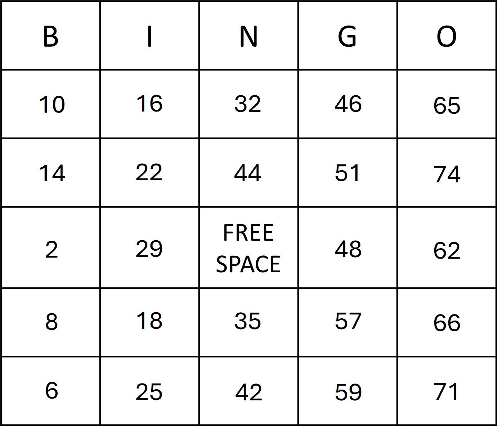

# Bingo_Kata

### 規則
- 賓果卡有 25 格
  - B 列範圍 1 - 15 
  - I 列範圍 16 - 30
  - N 列範圍 31 - 45 (第3格必須是 FREE SPACE)
  - G 列範圍 46 - 60
  - O 列範圍 61 - 75
- 賓果號碼
  - 數字介於 1 - 75 (遊戲中號碼不會重複)
- 檢查賓果卡
  - 賓果號碼在賓果卡必須連成垂直、水平或對角線才有賓果

### 測試案例
#### 賓果卡 (Bingo Card)
##### player A

##### player B

#### 賓果線 (Bingo Line)

#### `No Line`
| FakePickBallNumber | Output |
| :----: | :----: |
| [36, 11, 5, 75, 40] | "no winner. player A get 0 line, player B get 0 line. |

#### `Vertical Line`
| FakePickBallNumber | Output |
| :----: | :----: |
| [10, 2, 1, 11, 15] | "player A wins. player A get 1 line (V1), player B get 0 line. |
| [46, 51, 48, 57, 59] | "player B wins. player A get 0 line, player B get 1 lines (V4). |
| [55, 59, 51, 48, 54, 32, 44, 35, 42] | "no winner. player A get 1 line (V4), player B get 1 line (V3). |
| [28, 17, 29, 16, 22, 31, 45, 35, 41] | "player A wins. player A get 2 lines (V2,V3), player B get 0 line. |
| [10, 14, 2, 8, 6, 65, 74, 62, 66, 71] | "player B wins. player A get 0 line, player B get 2 lines (V1,V5). |

#### `Horizontal Line`
| FakePickBallNumber | Output |
| :----: | :----: |
| [10, 28, 31, 55, 61] | "player A wins. player A get 1 line (H1), player B get 0 line. |
| [8, 18, 35, 57, 66] | "player B wins. player A get 0 line, player B get 1 lines (H4). |
| [11, 16, 35, 48, 67, 2, 29, 48, 62] | "no winner. player A get 1 line (H4), player B get 1 line (H3). |

#### `Diagonal Line`
| FakePickBallNumber | Output |
| :----: | :----: |
| [10, 17, 48, 66] | [ "D1" ] |
| [61, 59, 16, 15] | [ "D2" ] |

### `Multiple Lines`
| FakePickBallNumber | Output |
| :----: | :----: |
| [31, 45, 35, 41 1, 29, 51, 74] | [ "V3", "H3" ] |
| [10, 2, 1, 11, 15 15, 22, 41, 54, 66 61, 59, 16, 15] | [ "V1", "H5", "D2" ] |