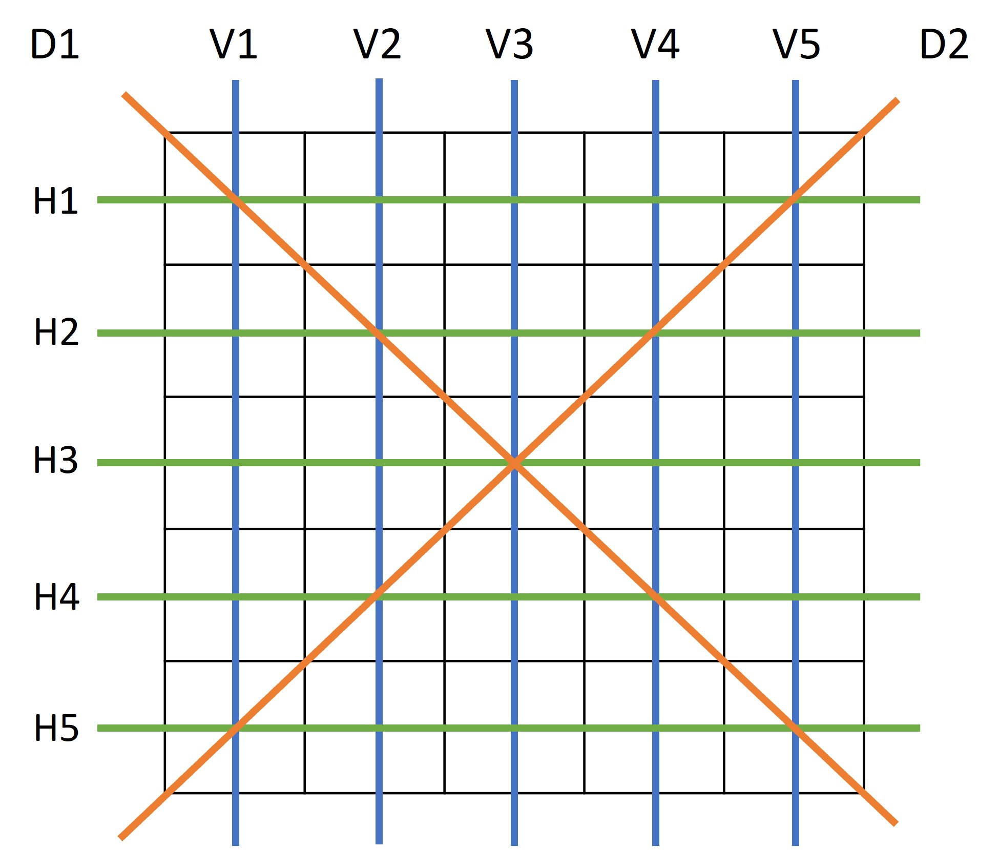

# Bingo_Kata
### 關於這個套路 
- [TDD BUDDY](https://www.tddbuddy.com/katas/bingo.html) 
- [codewars](https://www.codewars.com/kata/566d5e2e57d8fae53c00000c) 

### 規則
- 賓果卡有 25 格
  - B 列範圍 1 - 15 
  - I 列範圍 16 - 30
  - N 列範圍 31 - 45 (第3格必須是 FREE SPACE)
  - G 列範圍 46 - 60
  - O 列範圍 61 - 75
- 賓果號碼
  - 數字介於 1 - 75 (遊戲中號碼不會重複)
- 檢查賓果卡
  - 賓果號碼在賓果卡必須連成垂直、水平或對角線才有賓果

```C#
  class BingoGame
    
    List<int> pickNumbers

    BingoCard bingoCard

    public void pickBall()
      var randomNumber = new Random();
      pickNumbers.push(randomNumber)
    
    internal void pickBall(int number)
      pickNumbers.push(number)
      pickNumbers.ForEach(number =>
      {
        for (int row = 0; row < bingoCard.Card.GetLength(1); row++)
        {
          for (int col = 0; col < bingoCard.Card.GetLength(0); col++)
          {
              if (bingoCard.Card[row, col] == number)
              {
                  bingoCard.IsBingo[row, col] = true;
              }
          }
        }
      })

    
    public List<string> GetLines()
      var bingoLines = new List<string>();
      var isBingo = _bingoCard.IsBingo;
      var rows = isBingo.GetLength(0);
      var cols = isBingo.GetLength(1);
      for(int col = 0; col < cols; col++)
      {
        // 檢查直線
        if (isBingo[rows-1, col] &&
            isBingo[rows-2, col] &&
            isBingo[rows-3, col] &&
            isBingo[rows-4, col] &&
            isBingo[rows-5, col]) 
        {
          bingoLines.Add("V"+(col+1));
        }
      }

      var checkD1Line = 0;
      var checkD2Line = 0;
      var colIndex = cols;
      for (int row = 0; row < rows; row++)
      {
        // 檢查橫線
        if (isBingo[row, cols-1] &&
            isBingo[row, cols-2] &&
            isBingo[row, cols-3] &&
            isBingo[row, cols-4] &&
            isBingo[row, cols-5]) 
        {
          bingoLines.Add("H"+(row+1));
        }

        // 檢查對角線
        if (isBingo[row, row]) {
            checkD1Line++;
        }
        colIndex--;
        if (isBingo[col, colIndex]) {
            checkD2Line++;
        }
      }
      if (checkD1Line == 5) {
        bingoLines.Add("D1");
      }
      if (checkD2Line == 5) {
        bingoLines.Add("D2");
      }
      return bingoLines
```
```C#
  class BingoCard
    public int[,] Card { get; set; }
    public bool[,] IsBingo { get; set; }
```

### 測試案例
#### 賓果卡 (Bingo Card)


#### 賓果線 (Bingo Line)


#### `Vertical Line`
| FakePickBallNumbers | Output |
| :----: | :----: |
| [10, 2, 1, 11, 15] | [ "V1" ] |
| [28, 17, 29, 16, 22] | [ "V2" ] |
| [31, 45, 35, 41] | [ "V3" ] |
| [55, 59, 51, 48, 54] | [ "V4" ] |
| [61, 70, 74, 67, 66] | [ "V5" ] |

#### `Horizontal Line`
| FakePickBallNumbers | Output |
| :----: | :----: |
| [10, 28, 31, 55, 61] | [ "H1" ] |
| [2, 17, 45, 59, 70] | [ "H2" ] |
| [1, 29, 51, 74] | [ "H3" ] |
| [11, 16, 35, 48, 67] | [ "H4" ] |
| [15, 22, 41, 54, 66] | [ "H5" ] |

#### `Diagonal Line`
| FakePickBallNumbers | Output |
| :----: | :----: |
| [10, 17, 48, 66] | [ "D1" ] |
| [61, 59, 16, 15] | [ "D2" ] |

### `Multiple Lines`
| FakePickBallNumbers | Output |
| :----: | :----: |
| [31, 45, 35, 41, 1, 29, 51, 74] | [ "V3", "H3" ] |
| [10, 2, 1, 11, 15, 22, 41, 54, 66, 61, 59, 16, 15] | [ "V1", "H5", "D2" ] |
| [10, 17, 48, 66, 61, 59, 16, 15, 31, 45, 35, 41, 1, 29, 51, 74] | [ "V3", "H3", "D1", "D2" ] |
| [28, 17, 29, 16, 22, 55, 59, 51, 48, 54, 2, 45, 70, 11, 35, 67, 10, 66] | [ "V2", "V4", "H2", "H4", "D1" ] |